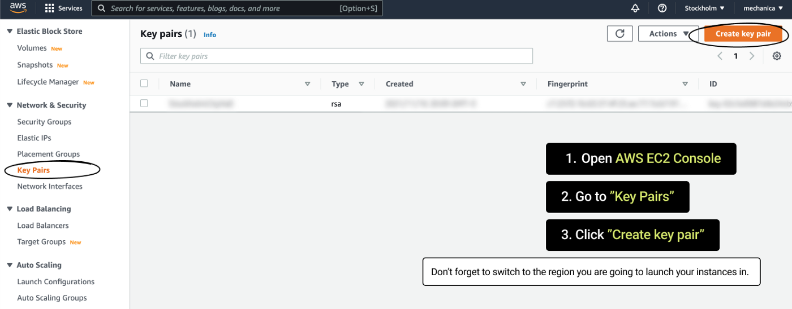
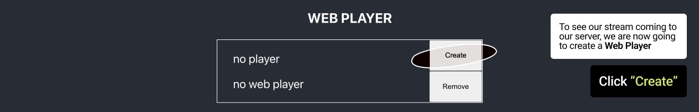

# Callaba Engine Manager (Test App)

<h2>How to setup</h2>

<h3>Credentials</h3>
So the first thing you have to do is to create and download your access keys.
1) Log into <a href="https://aws.amazon.com/console/">AWS Console</a>
2) Click onto your username, then select <b>Security credentials</b>
   
3) Expand Access keys (access keys ID and secret access key)
4) Click “Create New Access Key”
   
5) In the window that appears, click “Download Key File”
    

6) Then in <code>~</code> for Mac/Linux or in <code>C:\Users\<USER_NAME></code> for Windows 
   Create a folder <code>.aws</code> and a file <code>credentials</code>(with no extension) in it. 
   Write your credentials in the file this way: 
   <pre>
   [default]
   aws_access_key_id = YOUR_ACCESS_KEY_ID
   aws_secret_access_key = YOUR_SECRET_ACCESS_KEY
   </pre>

<h3>Security Group</h3>
<i>Attention! Create a security group in the region you plan to launch your instances in.</i> 
1) Log into <a href="https://aws.amazon.com/console/">AWS Console</a>
2) Change your region to the desired one
3) Go to <b>Security Groups</b>
4) Click <b>“Create security group”</b>
   
5) Then create a Security Group in AWS Console with those parameters: 
   <ul>
       <li>Name</li>
       <li>Description</li>
       <li>Inbound Rules:
           <ul>
               <li><b>Type</b> — All TCP, <b>Source</b> — Anywhere IPv4 </li>
               <li><b>Type</b> — All UDP, <b>Source</b> — Anywhere IPv4</li>
           </ul>
       </li>
       <li>Outbound rules
           <ul>
               <li><b>Type</b> — All Traffic, <b>Source</b> — Custom</li>
           </ul>
       </li>
   </ul>
   
   
   
6) Save the security group id to paste it in your <code>server/index.js</code> file like this
   <pre>const SECURITY_GROUP = "sg-0d17b51c3a3f8fab7"; // REPLACE WITH YOUR SECURITY GROUP ID</pre>

<h3>Key Pair</h3>
<i>Attention! Create a key pair in the region you plan to launch your instances in.</i>
1) Log into <a href="https://aws.amazon.com/console/">AWS Console</a>
2) Change your region to the desired one
3) Go to <b>Key Pairs</b>
4) Click <b>“Create key pair”</b>
   
   
5) Save the key pair name and paste it in the <code>server/index.js</code> under the security group id like this
   <pre>const KEY_PAIR_NAME = "us-test"; // REPLACE WITH YOUR KEY PAIR NAME</pre>

<h3>Region</h3>
In the same <code>server/index.js</code> file under the key pair paste the region that is active in your AWS Console so it looks like this
<pre>const REGION = "us-east-1"; // REPLACE WITH YOUR REGION</pre>

<h2>How to run</h2>
<i>You need <a href="https://nodejs.org/en/download/"><b>Node.js</b></a> to be installed on your computer.</i>
<h3>Server</h3>
Open <code>server</code> folder in terminal and run
<pre>npm i</pre>
<pre>node index.js</pre>

You will get something like this as a response

<pre>Your AMI creation date is - 5/3/2022

Server listening on 3001</pre>

<h3>Client</h3>
In the second terminal window open <code>client</code> folder and run

<pre>npm i</pre>
<pre>npm start</pre>

The web page will be automatically opened in your browser

<h2>How to use and how it works</h2>

<h3>Manage AWS Instance</h3>

Create a new instance.

You’ll see your instance launching.

Please wait for 2–3 minutes for your instance to complete launching.

<i>
Please keep in mind, once your instance is <b>Running</b>, it means you are being charged for the software and the hardware usage.

AWS Pay-As-You-Go model charges for <b>the time</b> you are using the resources. The system does not consider whether you are doing anything with the instance or not, whether you are sending any traffic or not.

This means that you need to <b>Stop</b> or <b>Terminate</b> you instance upon completion of your tasks to avoid unnecessary charges.
</i>

<h3>Creating SRT Server and sending a stream to it</h3>
Now we are going to create SRT Server to send our stream to.

- <h4>step 1: Authentication</h4>
   <pre>authenticate(){
      fetch('http://' + this.state.ipAddress + '/api/auth/login',
          {
              method: 'POST',
              headers: {
                  'Content-Type': 'application/json',
              },
              body: JSON.stringify(
                  {
                      email: "admin",
                      password: this.state.instanceData.Reservations[this.state.instanceIndex].Instances[0].InstanceId
                  })
          })
          .then(response => response.json())
          .then(data => {
              this.setState({callabaToken: data.token});
              console.log(data);
          })
   }
   </pre>
   The function requests <b>Callaba authentication token</b> and saves it to state to sign requests with it.
   
- <h4>step 2:  Creating an SRT server:</h4>
   <pre>createStream(){
      fetch('http://' + this.state.ipAddress + '/api/srt-servers/create',
          {
              method: 'POST',
              headers: {
                  'x-access-token': this.state.callabaToken,
                  'Content-Type': 'application/json',
              },
              body: JSON.stringify(
                  {
                      server_name: "Test SRT server", // CHANGE WITH ANY SERVER NAME YOU WANT
                      server_type: "SERVER_TYPE_SRT",
                      server_port: 1935,
                      server_latency: 200,
                      server_maxbw: -1,
                      server_timeout: 60,
                      server_rcvbuf: 48234496,
                      server_active: true
                      })
          })
          .then(response => response.json())
          .then(data => {
              this.setState({serverId: data._id, serverState: "server running"});
          })
   }</pre>
   In the request's body you can specify such settings as <code>server_name</code>, <code>server_port</code>
   After executing the request the received server id will be saved to state.

<h3>Creating a Web Player</h3>
To see our stream coming to our server, we are now going to create a <b>Web Player.</b>
- <h4>step 3: Creating a Web Player</h4>
   <pre>createPlayer(){
        fetch('http://' + this.state.instanceData.Reservations[this.state.instanceIndex].Instances[0].PublicIpAddress + '/api/vod/create',
            {
                method: 'POST',
                headers: {
                    'accept': 'application/json',
                    'x-access-token': this.state.callabaToken,
                    'Content-Type': 'application/json'
                },
                body: JSON.stringify(
                    {
                        active: true,
                        dash_fragment_length: 60,
                        dash_fragment_size: 3,
                        hls_fragment_length: 60,
                        hls_fragment_size: 3,
                        initial_live_manifest_size: 3,
                        input: {
                            input_module_id: this.state.serverId,
                            input_stream_id: "",
                            input_type: "INPUT_TYPE_SRT_SOFTWARE"
                        },
                        live_sync_duration_count: 3,
                        transcoding: {
                            audio_transcoding: "Disabled",
                            output_audio_bitrate: 320,
                            output_video_bitrate: 8000,
                            video_transcoding: "Disabled"
                        },
                        vod_name: "Test SRT player",
                        vod_port: 10001
                    })
            })
            .then(response => response.json())
            .then(data => this.setState({playerId: data._id, playerState: "running"}))
    }</pre>
   It uses the server id to specify the server it gets the stream from. 
   After receiving data as a response the function saves the player's id to state. It is used by app to generate a link to the created player:
   <pre>http:// + instanceIpAdress + /vod-player/ + playerId</pre>
  
- Once your player is ready, click <b>Web Player</b> link to view your stream in the browser.
   
- Wait for the player to load your stream, then click <b>play</b>.
   

<h3>Finishing your work</h3>
It is important to Stop or Terminate your instances upon completion of your stream or your task, as AWS Pay-As-You-Go model charges for the time you are using the resources.

Click “Stop” to stop your instance.

</img>

<h3>Other functions</h3>
<h4>Stopping an SRT stream</h4>
   <pre>  
   stopStream(){
      fetch('http://' + this.state.ipAddress + '/api/srt-servers/stop',
          {
              method: 'POST',
              headers: {
                  'accept': 'application/json',
                  'x-access-token': this.state.callabaToken,
                  'Content-Type': 'application/json'
              },
              body: JSON.stringify({id: this.state.serverId})
          })
          .then(response => response.json())
          .then(data => {
              if(data.ok) this.setState({serverState: "server stopped"});
          })
      }</pre>
<h4>Starting a stopped SRT stream</h4>
   <pre>startStream(){
      fetch('http://' + this.state.ipAddress + '/api/srt-servers/start',
          {
              method: 'POST',
              headers: {
                  'accept': 'application/json',
                  'x-access-token': this.state.callabaToken,
                  'Content-Type': 'application/json'
              },
              body: JSON.stringify({id: this.state.serverId})
          })
          .then(response => response.json())
          .then(data => {
              if(data.ok) this.setState({serverState: "server running"});
          })
      }</pre>
<h4>Deleting an SRT stream</h4>
   <pre>
   removeStream(){
      fetch('http://' + this.state.ipAddress + '/api/srt-servers/remove',
          {
              method: 'DELETE',
              headers: {
                  'accept': 'application/json',
                  'x-access-token': this.state.callabaToken,
                  'Content-Type': 'application/json'
              },
              body: JSON.stringify({id: this.state.serverId})
          })
          .then(response => response.json())
          .then(data => {
              if(data.ok) this.setState({serverState: "no server", serverId: "no server id"});
          })
      }
   </pre>
<h4>Removing a Web Player</h4>
   <pre>
   removePlayer(){
      fetch('http://' + this.state.ipAddress + '/api/vod/remove',
          {
              method: 'DELETE',
              headers: {
                  'accept': 'application/json',
                  'x-access-token': this.state.callabaToken,
                  'Content-Type': 'application/json'
              },
              body: JSON.stringify({id: this.state.playerId})
          })
          .then(response => response.json())
          .then(() => this.setState({playerState: "no player"}))
      }
   </pre>
<h4>Creating Restream</h4>
   <pre>
      createRestream(){
      fetch('http://'+ this.state.ipAddress +'/api/restream/create',
          {
              method: 'POST',
              headers: {
                  'accept': 'application/json',
                  'x-access-token': this.state.callabaToken,
                  'Content-Type':'application/json'
              },
              body: JSON.stringify({
                  restream_name: "Test restream",
                  restream_type: "RESTREAM_TYPE_SRT_TO_RTMP",
                  input: {
                      input_type: "INPUT_TYPE_SRT_SOFTWARE",
                      input_server_id: this.state.serverId,
                      input_stream_id: "publisher/test-srt-server/srt-stream-01",
                      module_name: "test youtube",
                      module_type: "MODULE_RESTREAM"
                  },
                  output: {
                      output_type: "OUTPUT_TYPE_OTHER_RTMP_URL",
                      output_stream_url : "rtmp://x.rtmp.youtube.com/live2" ,
                      output_stream_key: "f9da-dgj8-gq64-mjp2-7d0w"
                  },
                  active: true
              })
          })
          .then(response => response.json())
          .then(data => this.setState({restreamId: data._id}))
      }
   </pre>
<h4>Removing restream</h4>
   <pre>
     removeRestream(){
      fetch('http://'+ this.state.ipAddress +'/api/restream/remove',
          {
              method: 'DELETE',
              headers: {
                  'accept': 'application/json',
                  'x-access-token': this.state.callabaToken,
                  'Content-Type':'application/json'
              },
              body: JSON.stringify({id: this.state.restreamId})
          })
          .then(response => response.json())
          .then(() => this.setState({restreamId: "no restream"}))
      }
   </pre>

<h2>Tutorial</h2>
You can find a more detailed tutorial <a target="_blank" href='https://callabacloud.medium.com/creating-a-test-app-to-manage-callaba-engine-on-aws-using-a-restful-api-90947a3feb08'>here</a>.
